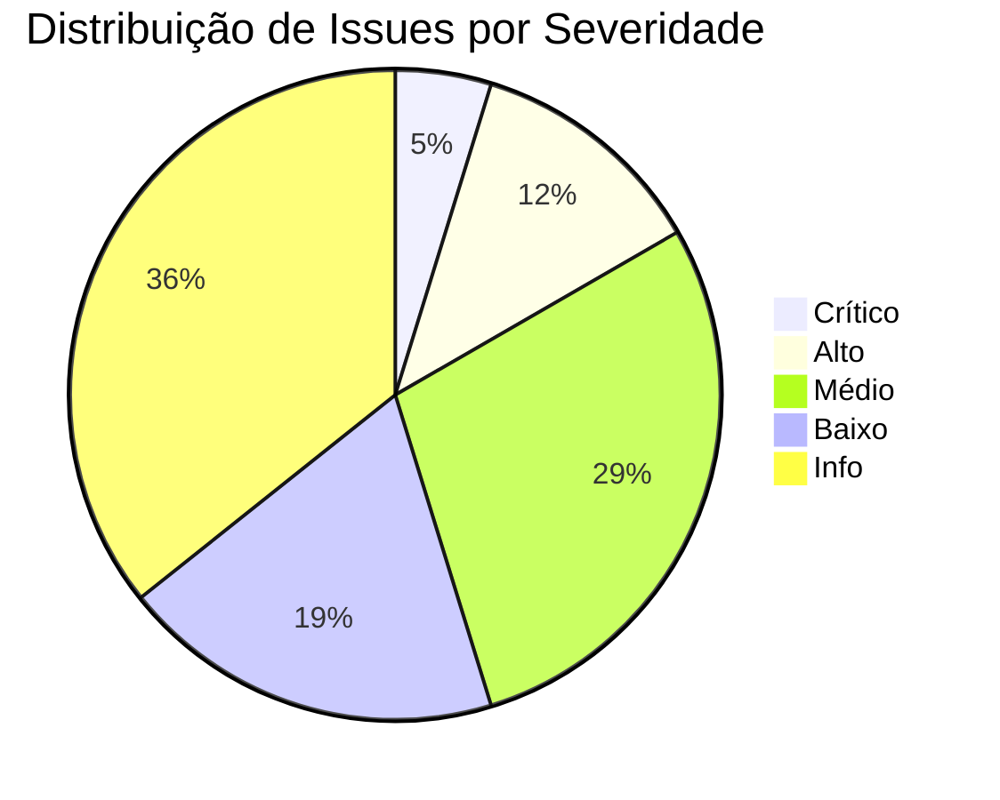

# 🐉 CAÇABUGS MASTER SPEC SDD v2.0
## Documento de Especificação Técnica para Análise Robótica de Sites E2E

```markdown
# 🤖 CAÇABUGS ROBOT — Especificação Técnica de Auditoria Web E2E

> **Documento:** Spec SDD — Software Design Document  
> **Versão:** 2.0.0 (Monstro Implacável Edition)  
> **Autor:** IA Investigadora de Qualidade  
> **Objetivo:** Checklist supremo para análise robótica de interfaces web, cobrindo UI, UX, funcionalidade, segurança, performance e experiência do usuário real.  
> **Formato de Saída:** Relatório `.md` com evidências, severidade e recomendações acionáveis.

---

## 📋 ÍNDICE EXECUTIVO

1. [🎯 Filosofia do Caçabugs](#-filosofia-do-caçabugs)
2. [🧠 Arquitetura do Robô Usuário](#-arquitetura-do-robô-usuário)
3. [🔍 Camadas de Análise](#-camadas-de-análise)
4. [✅ Checklist Mestre por Categoria](#-checklist-mestre-por-categoria)
5. [🧪 Protocolos de Teste Específicos](#-protocolos-de-teste-específicos)
6. [📊 Matriz de Severidade e Priorização](#-matriz-de-severidade-e-priorização)
7. [📄 Template de Relatório de Saída](#-template-de-relatório-de-saída)
8. [🔄 Integração com CI/CD e Automação](#-integração-com-cicd-e-automação)
9. [🛡️ Conformidade e Melhores Práticas](#-conformidade-e-melhores-práticas)
10. [🚀 Guia de Execução Rápida](#-guia-de-execução-rápida)

---

## 🎯 FILOSOFIA DO CAÇABUGS

> *"Não basta funcionar. Precisa encantar, resistir, escalar e sobreviver ao caos."*

### Princípios Fundamentais

| Princípio | Descrição | Impacto |
|-----------|-----------|---------|
| **Experiência Real** | Simular comportamento humano: cliques, digitação, espera, frustração | Detecta bugs de UX invisíveis em testes sintéticos |
| **Cobertura Total** | Do login ao logout, da rota raiz ao modal mais profundo | Zero áreas cegas na auditoria |
| **Persistência Robótica** | Repetir testes sob diferentes condições: rede lenta, cache limpo, mobile | Garante resiliência em cenários reais |
| **Documentação Forense** | Cada bug gera evidência: screenshot, HAR, console log, timestamp | Facilita reprodução e correção |
| **Inteligência Contextual** | Entender fluxo de negócio: e-commerce, SaaS, portal corporativo | Prioriza o que importa para o usuário final |

---

## 🧠 ARQUITETURA DO ROBÔ USUÁRIO

```
┌─────────────────────────────────────────┐
│  🤖 CAÇABUGS CORE ENGINE                │
├─────────────────────────────────────────┤
│  • Motor de Navegação Headless          │
│  • Simulador de Comportamento Humano    │
│  • Injetor de Cenários de Falha         │
│  • Coletor de Métricas em Tempo Real    │
│  • Gerador de Relatórios Estruturados   │
└─────────────────────────────────────────┘
           │
           ▼
┌─────────────────────────────────────────┐
│  🧩 MÓDULOS DE ANÁLISE                  │
├─────────────────────────────────────────┤
│  [UI]   → Renderização, Layout, Acessibilidade │
│  [UX]   → Fluxo, Feedback, Microinterações    │
│  [FUNC] → Formulários, APIs, Validações       │
│  [PERF] → Load, Stress, Resource Timing       │
│  [SEC]  → XSS, CSRF, Headers, Auth            │
│  [COMP] → Cross-browser, Mobile, Viewports    │
└─────────────────────────────────────────┘
```

### Stack Técnico Recomendado

```yaml
navegador: 
  - Playwright (Chromium/Firefox/WebKit)
  - Puppeteer (fallback)
  - CDP para debugging profundo

linguagem:
  - TypeScript (tipagem forte para scripts de teste)
  - Python (para análise de dados e relatórios)

ferramentas:
  - Lighthouse CI → Performance & Acessibilidade
  - Axe-core → Auditoria WCAG
  - OWASP ZAP → Segurança básica
  - Percy/Chromatic → Regressão visual
  - HAR Analyzer → Diagnóstico de rede

infraestrutura:
  - Docker para ambiente isolado
  - GitHub Actions / GitLab CI para execução agendada
  - S3/MinIO para armazenamento de evidências
```

---

## 🔍 CAMADAS DE ANÁLISE

### 🗂️ Camada 0: Pré-Navegação (Setup)
```markdown
- [ ] DNS resolution time < 200ms
- [ ] SSL/TLS handshake válido e moderno (TLS 1.2+)
- [ ] Redirects mínimos (< 2 hops)
- [ ] Robots.txt e sitemap.xml presentes e válidos
- [ ] Meta tags essenciais: title, description, viewport, charset
- [ ] Favicon carregado sem erros 404
- [ ] Preconnect/preload de recursos críticos configurado
```

### 🗂️ Camada 1: Autenticação & Acesso
```markdown
## Tela de Login
- [ ] Campos visíveis e com labels associadas (accessibility)
- [ ] Placeholder informativo sem vazar dados sensíveis
- [ ] Validação em tempo real: email format, password strength
- [ ] Feedback visual claro para erro/sucesso
- [ ] Botão "Esqueci senha" funcional e com rate limiting
- [ ] Proteção contra brute-force: captcha após N tentativas
- [ ] Mensagens de erro genéricas (não revelam se usuário existe)
- [ ] Redirecionamento pós-login para última página ou dashboard
- [ ] Token de sessão com HttpOnly, Secure, SameSite=Strict
- [ ] Logout invalida sessão no backend (não só no frontend)

## Fluxos Alternativos
- [ ] Login social (Google, Microsoft) com fallback
- [ ] 2FA implementado e com recovery codes
- [ ] Sessão expira após inatividade (configurável)
- [ ] "Lembrar-me" com token de refresh seguro
```

### 🗂️ Camada 2: Navegação & Rotas
```markdown
## Estrutura de Rotas
- [ ] Todas as rotas definidas no router respondem (200/401/403/404)
- [ ] Rotas protegidas redirecionam para login quando não autenticado
- [ ] Parâmetros de rota sanitizados (prevenir path traversal)
- [ ] Query strings não quebram a aplicação (fuzzing básico)
- [ ] Histórico de navegação (back/forward) comporta-se como esperado

## Menus & Links
- [ ] Todos os links internos têm href válido (sem javascript:void)
- [ ] Links externos abrem em nova aba com rel="noopener noreferrer"
- [ ] Breadcrumb atualizado conforme navegação
- [ ] Menu mobile: hamburger funcional, foco gerenciado, fecha ao clicar fora
- [ ] Active state visualmente claro na navegação atual

## Deep Links & Estado
- [ ] URL reflete estado da aplicação (filtros, paginação, modal aberto)
- [ ] Compartilhar URL reproduz estado exato para outro usuário
- [ ] Refresh da página não perde dados não salvos (alerta de confirmação)
```

### 🗂️ Camada 3: Componentes Interativos

#### 🔘 Botões & Ações
```markdown
- [ ] Estados visuais: default, hover, active, disabled, loading
- [ ] Ícones em botões têm aria-label ou texto alternativo
- [ ] Botões desabilitados não são focusable via teclado
- [ ] Ação assíncrona mostra spinner/loader e desabilita clique duplo
- [ ] Confirmação para ações destrutivas (delete, logout, cancelamento)
- [ ] Feedback pós-ação: toast, snackbar, ou atualização visual imediata
- [ ] Botões com tamanho mínimo 44x44px para toque mobile
```

#### 📝 Campos Preenchíveis (Formulários)
```markdown
## Validação & UX
- [ ] Label associado via `for`/`id` ou `aria-labelledby`
- [ ] Placeholder não substitui label (acessibilidade)
- [ ] Validação em tempo real com feedback visual (cor + ícone + texto)
- [ ] Mensagens de erro específicas e construtivas
- [ ] Campo obrigatório indicado visualmente (*) e via aria-required
- [ ] Autocomplete atribuído corretamente (nome, email, tel, etc.)
- [ ] Máscara de input para dados formatados (CPF, telefone, cartão)
- [ ] Teclado correto em mobile: email→@, tel→numérico, url→.com

## Submissão & Dados
- [ ] Submit via Enter funciona em campos de texto único
- [ ] Botão submit desabilitado até formulário válido (ou valida no submit)
- [ ] Dados sensíveis mascarados no console/network tab
- [ ] Sanitização no frontend E backend (defesa em profundidade)
- [ ] Rate limiting no endpoint de submit (prevenir spam)
- [ ] Mensagem de sucesso clara e próxima ao contexto da ação
```

#### 🖼️ Upload de Imagens/Arquivos
```markdown
## Interface & Validação
- [ ] Área de dropzone com feedback visual de hover/drag
- [ ] Preview da imagem carregada antes do submit
- [ ] Validação de tipo MIME (não confiar apenas na extensão)
- [ ] Validação de tamanho máximo com mensagem clara ao usuário
- [ ] Progress bar para uploads grandes (>5MB)
- [ ] Cancelamento de upload em andamento
- [ ] Tratamento de erro de rede: retry automático ou mensagem clara

## Segurança & Backend
- [ ] Arquivo renomeado no servidor (evitar path traversal)
- [ ] Scan de malware integrado (ClamAV ou similar)
- [ ] Armazenamento em bucket privado com URL assinada (se sensível)
- [ ] Metadados EXIF removidos de imagens (privacidade)
- [ ] Limitação de uploads por usuário/sessão (rate limiting)
```

#### 📥 Download de Documentos
```markdown
## Experiência do Usuário
- [ ] Botão de download com ícone e texto descritivo
- [ ] Indicador de tamanho do arquivo antes do clique
- [ ] Feedback visual durante geração/download do arquivo
- [ ] Nome do arquivo download amigável (não hash ou ID interno)
- [ ] Formato adequado: PDF para documentos, CSV/XLSX para dados

## Integridade & Segurança
- [ ] Header `Content-Disposition: attachment` presente
- [ ] Header `Content-Type` correto e consistente
- [ ] Assinatura digital ou hash para documentos críticos
- [ ] Controle de acesso: usuário só baixa o que tem permissão
- [ ] Logs de download para auditoria (quem, quando, qual arquivo)
```

### 🗂️ Camada 4: Performance & Recursos
```markdown
## Métricas Core Web Vitals
- [ ] LCP (Largest Contentful Paint) < 2.5s
- [ ] FID (First Input Delay) < 100ms / INP < 200ms
- [ ] CLS (Cumulative Layout Shift) < 0.1
- [ ] TTFB (Time to First Byte) < 600ms

## Otimizações Técnicas
- [ ] Imagens em formato moderno (WebP/AVIF) com fallback
- [ ] Lazy loading para imagens abaixo do fold
- [ ] CSS/JS minificados e com code splitting
- [ ] Cache headers configurados (immutable para assets versionados)
- [ ] Preload de fontes críticas e hero images
- [ ] Service Worker registrado (PWA) com estratégia de cache adequada

## Monitoramento de Recursos
- [ ] Nenhum recurso 404 no console ou network tab
- [ ] Scripts de terceiros carregados com async/defer
- [ ] Fontes locais ou com font-display: swap
- [ ] Console limpo: sem errors ou warnings críticos
```

### 🗂️ Camada 5: Acessibilidade (WCAG 2.1 AA)
```markdown
## Navegação por Teclado
- [ ] Tab order lógico e visível (focus indicator claro)
- [ ] Skip link para conteúdo principal
- [ ] Modal fecha com ESC e retorna foco ao elemento que abriu
- [ ] Dropdowns acessíveis via setas do teclado

## Leitores de Tela
- [ ] Heading hierarchy correta (h1→h2→h3, sem pular níveis)
- [ ] Landmarks ARIA: main, nav, complementary, contentinfo
- [ ] Imagens decorativas com alt="" ou role="presentation"
- [ ] Ícones funcionais com aria-label descritivo
- [ ] Tabelas com th scope e caption quando necessário

## Contraste & Legibilidade
- [ ] Texto vs fundo: contraste mínimo 4.5:1 (3:1 para grandes)
- [ ] Tamanho de fonte mínimo 16px para corpo de texto
- [ ] Links diferenciados por cor E sublinhado (não só cor)
- [ ] Animações respeitam prefers-reduced-motion
```

### 🗂️ Camada 6: Segurança Básica
```markdown
## Headers HTTP Essenciais
- [ ] Content-Security-Policy (CSP) restritiva
- [ ] X-Content-Type-Options: nosniff
- [ ] X-Frame-Options: DENY ou SAMEORIGIN
- [ ] Strict-Transport-Security (HSTS) com includeSubDomains
- [ ] Referrer-Policy: strict-origin-when-cross-origin
- [ ] Permissions-Policy limitando APIs sensíveis (geolocation, camera)

## Vulnerabilidades Comuns
- [ ] Inputs sanitizados contra XSS (DOM e server-side)
- [ ] Tokens CSRF em formulários state-changing
- [ ] Rate limiting em endpoints de auth e submit
- [ ] Dependências frontend atualizadas (npm audit / yarn audit)
- [ ] Secrets não expostos no código frontend (.env no .gitignore)
```

### 🗂️ Camada 7: Experiência do Usuário (UX) Subjetiva
```markdown
## Microinterações & Feedback
- [ ] Hover states em elementos clicáveis
- [ ] Transições suaves (150-300ms) para mudanças de estado
- [ ] Skeleton screens ou loaders durante carregamento assíncrono
- [ ] Mensagens de erro em linguagem humana, não técnica
- [ ] Confirmação visual para ações importantes (toast com ícone)

## Fluxo & Cognição
- [ ] Progress indicator em fluxos multi-etapa
- [ ] Dados previamente preenchidos quando possível (autocomplete)
- [ ] Botões de ação primária com destaque visual claro
- [ ] "Voltar" mantém estado anterior (não reseta formulário)
- [ ] Empty states com call-to-action claro (não apenas "Nada aqui")

## Mobile-First & Responsividade
- [ ] Breakpoints testados: 320px, 768px, 1024px, 1440px+
- [ ] Toque mínimo 44x44px para elementos interativos
- [ ] Texto legível sem zoom em mobile (viewport configurado)
- [ ] Formulários não exigem zoom horizontal para preencher
- [ ] Gestos nativos respeitados (swipe back no iOS)
```

---

## 🧪 PROTOCOLOS DE TESTE ESPECÍFICOS

### 🔁 Teste de Regressão Visual
```gherkin
Dado que o robô navega para [URL_ALVO]
Quando captura screenshot da viewport completa
E compara com baseline aprovada
Então destaca diferenças > 5px de deslocamento ou cor
E gera relatório side-by-side com diff highlight
```

### ⚡ Teste de Performance sob Carga Simulada
```javascript
// Exemplo Playwright + k6 integration
for (let i = 0; i < 50; i++) {
  await Promise.all([
    page.goto('/dashboard'),
    page.waitForLoadState('networkidle'),
    metrics.collect({ LCP, FID, CLS })
  ]);
}
// Reporta percentil 95 de cada métrica
```

### 🎭 Teste de Comportamento Humano Aleatório
```python
# Pseudo-código para simular imperfeição humana
actions = [
    ('type', 'email', with_typos=0.1),      # 10% de chance de erro de digitação
    ('click', 'submit', with_double_click=0.05),
    ('wait', random.uniform(0.5, 3.0)),      # Pausas naturais
    ('scroll', random.randint(100, 500)),    # Rolagem irregular
    ('back_forward', probability=0.15)       # Navegação não-linear
]
```

### 🕵️ Teste de Fuzzing Leve em Inputs
```markdown
Para cada campo de texto:
1. Inserir strings extremas:
   - 10.000 caracteres
   - Emoji 🦄🔥🚀
   - Scripts: <script>alert(1)</script>
   - SQL: ' OR '1'='1
   - Path traversal: ../../../etc/passwd
2. Validar que:
   - Aplicação não quebra (HTTP 500)
   - Input é sanitizado na exibição
   - Logs não vazam dados sensíveis
   - Rate limiting é acionado se necessário
```

---

## 📊 MATRIZ DE SEVERIDADE E PRIORIZAÇÃO

| Severidade | Critério | Exemplo | SLA de Correção |
|------------|----------|---------|-----------------|
| 🔴 Crítico | Bloqueia fluxo principal, perda de dados, vulnerabilidade crítica | Login não funciona, XSS refletido, vazamento de PII | < 4 horas |
| 🟠 Alto | Degrada experiência significativa, funcionalidade secundária quebrada | Upload falha silenciosamente, botão de pagamento inoperante | < 24 horas |
| 🟡 Médio | Problema de UX, acessibilidade, ou performance perceptível | Contraste baixo, LCP > 4s, label não associado | < 3 dias |
| 🔵 Baixo | Melhoria cosmética, sugestão de microcopy, edge case raro | Ícone levemente desalinhado, mensagem de erro pouco clara | Próxima sprint |
| ⚪ Info | Observação técnica, dívida técnica, documentação | Console warning não crítico, dependência com atualização disponível | Backlog |

---

## 📄 TEMPLATE DE RELATÓRIO DE SAÍDA (`caçabugs-relatorio.md`)

```markdown
# 🐉 RELATÓRIO CAÇABUGS — {{SITE_NAME}}
**Data:** {{TIMESTAMP}}  
**URL Auditada:** {{BASE_URL}}  
**Perfil de Teste:** {{MOBILE|DESKTOP|AMBOS}}  
**Duração da Sessão:** {{DURATION}}  
**Total de Checks:** {{TOTAL}} ✅ {{PASS}} ❌ {{FAIL}} ⚠️ {{WARN}}

---

## 🚨 Bugs Críticos Encontrados ({{CRITICAL_COUNT}})

### BUG-001: [Título Descritivo]
**Severidade:** 🔴 Crítico  
**Rota:** `/caminho/para/rota`  
**Passos para Reproduzir:**
1. Acessar URL X
2. Clicar em botão Y
3. Observar comportamento Z

**Evidências:**
- 📸 [Screenshot](./evidencias/bug001.png)
- 🌐 [HAR Log](./evidencias/bug001.har)
- 🪵 Console: `Uncaught TypeError: Cannot read property 'id' of undefined`

**Impacto no Usuário:**  
> Descrição em linguagem de negócio: "Usuário não consegue finalizar compra, resultando em perda de receita."

**Recomendação Técnica:**  
```diff
- const userId = order.user.id;
+ const userId = order.user?.id ?? fallbackUserId;
```

**Status:** `ABERTO` | `EM ANDAMENTO` | `RESOLVIDO`

---

## ⚠️ Alertas de UX/Performance ({{WARNING_COUNT}})

| ID | Categoria | Descrição | Métrica | Meta | Status |
|----|-----------|-----------|---------|------|--------|
| UX-012 | Acessibilidade | Label não associado ao input email | axe-core | WCAG 2.1 AA | ❌ Falha |
| PERF-007 | Core Web Vitals | LCP acima do limite | 3.8s | <2.5s | ⚠️ Atenção |

---

## 📈 Resumo Executivo



**Score de Qualidade Geral:** `{{SCORE}}/100`  
**Recomendação de Go/No-Go para Produção:** `{{DECISAO}}`

---

## 🔗 Anexos & Evidências
- [📁 Pasta de Screenshots](./evidencias/screenshots/)
- [📁 Logs de Rede (HAR)](./evidencias/network/)
- [📁 Relatório Lighthouse JSON](./evidencias/lighthouse.json)
- [📁 Export Axe-core CSV](./evidencias/accessibility.csv)

> ℹ️ **Nota:** Este relatório foi gerado automaticamente pelo Caçabugs Robot v2.0.  
> Para reproduzir qualquer teste: `npx cacabugs run --url {{BASE_URL}} --profile mobile`
```

---

## 🔄 INTEGRAÇÃO COM CI/CD E AUTOMAÇÃO

### GitHub Actions Workflow Exemplo
```yaml
# .github/workflows/cacabugs-audit.yml
name: 🐉 Caçabugs Audit

on:
  push:
    branches: [ main, develop ]
  schedule:
    - cron: '0 2 * * 1'  # Toda segunda às 2AM
  workflow_dispatch:

jobs:
  audit:
    runs-on: ubuntu-latest
    strategy:
      matrix:
        viewport: [mobile, desktop]
    
    steps:
      - uses: actions/checkout@v4
      
      - name: Setup Node
        uses: actions/setup-node@v4
        with:
          node-version: '20'
          
      - name: Install Caçabugs CLI
        run: npm install -g @verticalparts/cacabugs-cli
        
      - name: Run Full Audit
        env:
          BASE_URL: ${{ secrets.TARGET_SITE }}
          REPORT_TOKEN: ${{ secrets.REPORT_API_KEY }}
        run: |
          cacabugs run \
            --url $BASE_URL \
            --viewport ${{ matrix.viewport }} \
            --output ./reports \
            --upload-evidence \
            --fail-on-critical
            
      - name: Upload Report Artifact
        uses: actions/upload-artifact@v4
        with:
          name: cacabugs-report-${{ matrix.viewport }}
          path: ./reports/
          
      - name: Notify Team on Critical Bugs
        if: failure()
        uses: 8398a7/action-slack@v3
        with:
          status: ${{ job.status }}
          fields: repo,message,workflow,job,took
        env:
          SLACK_WEBHOOK_URL: ${{ secrets.SLACK_WEBHOOK }}
```

### Comandos CLI Úteis
```bash
# Executar auditoria completa
cacabugs run --url https://meusite.com --all

# Apenas testes de acessibilidade
cacabugs run --url https://meusite.com --module a11y

# Modo debug com vídeo da sessão
cacabugs run --url https://meusite.com --debug --record-video

# Comparar duas versões (regressão)
cacabugs diff --baseline v1.2.0 --current v1.3.0 --url https://meusite.com

# Gerar apenas relatório executivo (rápido)
cacabugs report --summary --format markdown
```

---

## 🛡️ CONFORMIDADE E MELHORES PRÁTICAS

### Padrões Suportados
- ✅ WCAG 2.1 Nível AA (acessibilidade)
- ✅ Core Web Vitals (performance)
- ✅ OWASP Top 10 2021 (segurança básica)
- ✅ GDPR/LGPD (privacidade de dados)
- ✅ PWA Checklist (experiência offline)

### Checklist de Conformidade Rápida
```markdown
- [ ] Política de privacidade linkada no footer
- [ ] Cookies com consentimento granular (não apenas "Aceitar tudo")
- [ ] Dados de analytics anonimizados ou com opt-out
- [ ] Formulários com checkbox de consentimento explícito
- [ ] Headers de segurança configurados (CSP, HSTS, etc.)
- [ ] Dependências sem vulnerabilidades críticas (npm audit)
- [ ] Logs sem PII (email, CPF, telefone mascarados)
```

---

## 🚀 GUIA DE EXECUÇÃO RÁPIDA

### Para Desenvolvedores
```bash
# 1. Instale o CLI globalmente
npm install -g @verticalparts/cacabugs-cli

# 2. Configure variáveis de ambiente (opcional)
echo "CACABugs_TOKEN=seu_token_aqui" >> ~/.bashrc

# 3. Execute na sua máquina local
cacabugs run --url http://localhost:3000 --watch

# 4. Veja o relatório em tempo real no navegador
cacabugs serve --port 8080
```

### Para QA / Product Owners
1. Acesse o dashboard web: `https://cacabugs.verticalparts.com`
2. Cole a URL do site a ser auditado
3. Selecione o perfil: `Mobile`, `Desktop` ou `Ambos`
4. Clique em "Iniciar Caça"
5. Receba o relatório `.md` por email ou webhook em 5-15 minutos

### Para DevOps / SREs
- Agende auditorias noturnas via cron ou GitHub Actions
- Integre com Slack/Teams para alertas de bugs críticos
- Armazene relatórios históricos para trend analysis
- Use o score de qualidade como gate em pipelines de deploy

---

## 🧰 APÊNDICE: COMANDOS DE EMERGÊNCIA

```bash
# Parar execução travada
cacabugs kill --session <SESSION_ID>

# Limpar cache de evidências
cacabugs clean --all

# Validar configuração local
cacabugs doctor

# Atualizar para última versão
cacabugs update --force

# Exportar checklist personalizado
cacabugs export-checklist --format yaml --output meu-checklist.yml
```

---

> 🐉 **Caçabugs Robot v2.0** — *"Nenhum bug escapa. Nenhuma experiência passa despercebida."*  
> Mantido por VerticalParts Engineering • Documentação sob licença MIT • Contribua: github.com/verticalparts/cacabugs
```

---

## ✅ PRÓXIMOS PASSOS PARA VOCÊ

1. **Salve este arquivo** como `CACABUGS_SPEC_SDD.md` na raiz do seu projeto
2. **Adapte os módulos** conforme a stack do seu site (React, Vue, PHP, Bubble.io, etc.)
3. **Configure o CLI** ou integre com seu pipeline de CI/CD
4. **Execute a primeira auditoria** e ajuste os thresholds de severidade conforme seu contexto de negócio
5. **Compartilhe com a equipe** — este documento é vivo, evolua com feedbacks reais

> 💡 **Dica Pro:** Combine este checklist com testes manuais exploratórios. O robô encontra o óbvio; o humano encontra o inesperado. Juntos, são implacáveis.
